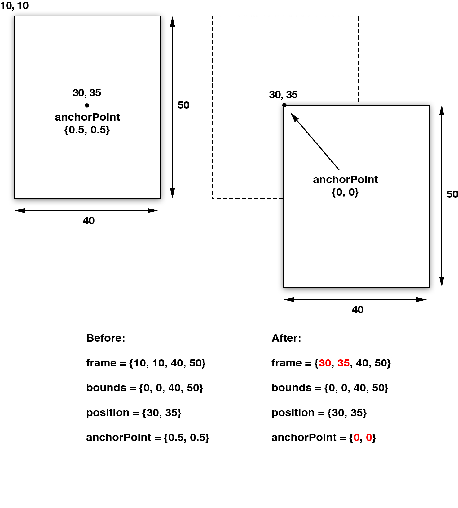

## Core Animation

【参考】[ios核心动画高级技巧](https://zsisme.gitbooks.io/ios-/content/index.html)

### 介绍
>Core Animation其实是一个令人误解的命名。你可能认为它只是用来做动画的，但实际上它是从一个叫做Layer Kit这么一个不怎么和动画有关的名字演变而来，所以做动画这只是Core Animation特性的冰山一角。

>Core Animation是一个复合引擎，它的职责就是尽可能快地组合屏幕上不同的可视内容，这个内容是被分解成独立的图层，存储在一个叫做图层树的体系之中。于是这个树形成了UIKit以及在iOS应用程序当中你所能在屏幕上看见的一切的基础。


### 图层树

#### 但是为什么iOS要基于UIView和CALayer提供两个平行的层级关系呢？为什么不用一个简单的层级来处理所有事情呢？

>原因在于要做职责分离，这样也能避免很多重复代码。在iOS和Mac OS两个平台上，事件和用户交互有很多地方的不同，基于多点触控的用户界面和基于鼠标键盘有着本质的区别，这就是为什么iOS有UIKit和UIView，但是Mac OS有AppKit和NSView的原因。他们功能上很相似，但是在实现上有着显著的区别。

### 寄宿图

#### contents属性。

`contents`

`contentsGravity` (UIView : contentMode)

`contentsScale` (UIView : contentScaleFactor) 

如果contentsScale设置为1.0，将会以每个点1个像素绘制图片，如果设置为2.0，则会以每个点2个像素绘制图片，这就是我们熟知的Retina屏幕。（如果你对像素和点的概念不是很清楚的话，这个章节的后面部分将会对此做出解释）。

`masksToBounds` (UIView : clipsToBounds)

`contentsRect`

和bounds，frame不同，contentsRect不是按点来计算的，它使用了单位坐标，单位坐标指定在0到1之间，是一个相对值（像素和点就是绝对值）。所以他们是相对与寄宿图的尺寸的。iOS使用了以下的坐标系统：

- 点 —— 在iOS和Mac OS中最常见的坐标体系。点就像是虚拟的像素，也被称作逻辑像素。在标准设备上，一个点就是一个像素，但是在Retina设备上，一个点等于2*2个像素。iOS用点作为屏幕的坐标测算体系就是为了在Retina设备和普通设备上能有一致的视觉效果。
- 像素 —— 物理像素坐标并不会用来屏幕布局，但是仍然与图片有相对关系。UIImage是一个屏幕分辨率解决方案，所以指定点来度量大小。但是一些底层的图片表示如CGImage就会使用像素，所以你要清楚在Retina设备和普通设备上，他们表现出来了不同的大小。
- 单位 —— 对于与图片大小或是图层边界相关的显示，单位坐标是一个方便的度量方式， 当大小改变的时候，也不需要再次调整。单位坐标在OpenGL这种纹理坐标系统中用得很多，Core Animation中也用到了单位坐标。

`contentsCenter` (UIView : resizableImageWithCapInsets:)

#### Custom Drawing

也可以直接用Core Graphics直接绘制寄宿图。

-drawRect: 方法没有默认的实现，因为对UIView来说，寄宿图并不是必须的，它不在意那到底是单调的颜色还是有一个图片的实例。如果UIView检测到-drawRect: 方法被调用了，它就会为视图分配一个寄宿图，这个寄宿图的像素尺寸等于视图大小乘以 contentsScale的值。

如果你不需要寄宿图，那就不要创建这个方法了，这会造成CPU资源和内存的浪费，这也是为什么苹果建议：如果没有自定义绘制的任务就不要在子类中写一个空的-drawRect:方法。

UIView 的 -drawRect: 方法， 底层是CALayer安排(CALayerDelegate)了重绘工作和保存了因此产生的图片。

CALayerDelegate ： 

当需要被重绘时，CALayer会请求它的代理给他一个寄宿图来显示。它通过调用下面这个方法做到的:

```
(void)displayLayer:(CALayerCALayer *)layer;
```

可以在这个方法里直接设置contents属性。如果代理不实现-displayLayer:方法，CALayer就会转而尝试调用下面这个方法：

```
- (void)drawLayer:(CALayer *)layer inContext:(CGContextRef)ctx;
```

在调用这个方法之前，CALayer创建了一个合适尺寸的空寄宿图（尺寸由bounds和contentsScale决定）和一个Core Graphics的绘制上下文环境，为绘制寄宿图做准备，他作为ctx参数传入。

UIView的图层的delegate是UIView自己。

### 图层几何学

#### 布局

UIView : `frame` `bounds` `center`。

相当于

CALayer : `frame` `bounds` `position`。

对于视图或者图层来说，frame并不是一个非常清晰的属性，它其实是一个虚拟属性，是根据bounds，position和transform计算而来，所以当其中任何一个值发生改变，frame都会变化。相反，改变frame的值同样会影响到他们当中的值。

记住当对图层做变换的时候，比如旋转或者缩放，frame实际上代表了覆盖在图层旋转之后的整个轴对齐的矩形区域，也就是说frame的宽高可能和bounds的宽高不再一致了。


#### 锚点 (anchorPoint)

之前提到过，视图的center属性和图层的position属性都指定了anchorPoint相对于父图层的位置。图层的anchorPoint通过position来控制它的frame的位置，你可以认为anchorPoint是用来移动图层的把柄。

默认来说，anchorPoint位于图层的中点，所以图层的将会以这个点为中心放置。anchorPoint属性并没有被UIView接口暴露出来，这也是视图的position属性被叫做“center”的原因。但是图层的anchorPoint可以被移动，比如你可以把它置于图层frame的左上角，于是图层的内容将会向右下角的position方向移动（图3.3），而不是居中了。



#### 坐标系

CALayer给不同坐标系之间的图层转换提供了一些工具类方法：

```
- (CGPoint)convertPoint:(CGPoint)point fromLayer:(CALayer *)layer;
- (CGPoint)convertPoint:(CGPoint)point toLayer:(CALayer *)layer;
- (CGRect)convertRect:(CGRect)rect fromLayer:(CALayer *)layer;
- (CGRect)convertRect:(CGRect)rect toLayer:(CALayer *)layer;
```

`geometryFlipped`

`Z坐标轴` 和UIView严格的二维坐标系不同，CALayer存在于一个三维空间当中。除了我们已经讨论过的position和anchorPoint属性之外，CALayer还有另外两个属性，zPosition和anchorPointZ

#### Hit Testing

CALayer并不关心任何响应链事件，所以不能直接处理触摸事件或者手势。但是它有一系列的方法帮你处理事件：`-containsPoint:`和`-hitTest:`。

- `-containsPoint:` 接受一个在本图层坐标系下的CGPoint，如果这个点在图层frame范围内就返回YES。
- `-hitTest:` 方法同样接受一个CGPoint类型参数，而返回值不是BOOL类型，它返回图层本身，或者包含这个坐标点的叶子节点图层。这意味着不再需要像使用`-containsPoint:`那样，人工地在每个子图层变换或者测试点击的坐标。如果这个点在最外面图层的范围之外，则返回nil。

#### 自动布局

当使用视图的时候，可以充分利用UIView类接口暴露出来的UIViewAutoresizingMask和NSLayoutConstraintAPI，但如果想随意控制CALayer的布局，就需要手工操作。最简单的方法就是使用CALayerDelegate如下函数：

```
- (void)layoutSublayersOfLayer:(CALayer *)layer;
```
当图层的bounds发生改变，或者图层的-setNeedsLayout方法被调用的时候，这个函数将会被执行。这使得你可以手动地重新摆放或者重新调整子图层的大小，但是不能像UIView的autoresizingMask和constraints属性做到自适应屏幕旋转。

这也是为什么最好使用视图而不是单独的图层来构建应用程序的另一个重要原因之一。


