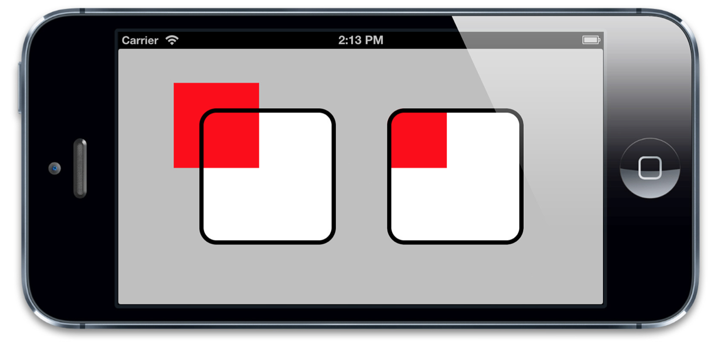

## Core Animation

【参考】[ios核心动画高级技巧](https://zsisme.gitbooks.io/ios-/content/index.html)

### 介绍
>Core Animation其实是一个令人误解的命名。你可能认为它只是用来做动画的，但实际上它是从一个叫做Layer Kit这么一个不怎么和动画有关的名字演变而来，所以做动画这只是Core Animation特性的冰山一角。

>Core Animation是一个复合引擎，它的职责就是尽可能快地组合屏幕上不同的可视内容，这个内容是被分解成独立的图层，存储在一个叫做图层树的体系之中。于是这个树形成了UIKit以及在iOS应用程序当中你所能在屏幕上看见的一切的基础。


### 1. 图层树

#### 但是为什么iOS要基于UIView和CALayer提供两个平行的层级关系呢？为什么不用一个简单的层级来处理所有事情呢？

>原因在于要做职责分离，这样也能避免很多重复代码。在iOS和Mac OS两个平台上，事件和用户交互有很多地方的不同，基于多点触控的用户界面和基于鼠标键盘有着本质的区别，这就是为什么iOS有UIKit和UIView，但是Mac OS有AppKit和NSView的原因。他们功能上很相似，但是在实现上有着显著的区别。

### 2. 寄宿图

#### 2.1. contents属性。

`contents`

`contentsGravity` (UIView : contentMode)

`contentsScale` (UIView : contentScaleFactor) 

如果contentsScale设置为1.0，将会以每个点1个像素绘制图片，如果设置为2.0，则会以每个点2个像素绘制图片，这就是我们熟知的Retina屏幕。（如果你对像素和点的概念不是很清楚的话，这个章节的后面部分将会对此做出解释）。

`masksToBounds` (UIView : clipsToBounds)

`contentsRect`

和bounds，frame不同，contentsRect不是按点来计算的，它使用了单位坐标，单位坐标指定在0到1之间，是一个相对值（像素和点就是绝对值）。所以他们是相对与寄宿图的尺寸的。iOS使用了以下的坐标系统：

- 点 —— 在iOS和Mac OS中最常见的坐标体系。点就像是虚拟的像素，也被称作逻辑像素。在标准设备上，一个点就是一个像素，但是在Retina设备上，一个点等于2*2个像素。iOS用点作为屏幕的坐标测算体系就是为了在Retina设备和普通设备上能有一致的视觉效果。
- 像素 —— 物理像素坐标并不会用来屏幕布局，但是仍然与图片有相对关系。UIImage是一个屏幕分辨率解决方案，所以指定点来度量大小。但是一些底层的图片表示如CGImage就会使用像素，所以你要清楚在Retina设备和普通设备上，他们表现出来了不同的大小。
- 单位 —— 对于与图片大小或是图层边界相关的显示，单位坐标是一个方便的度量方式， 当大小改变的时候，也不需要再次调整。单位坐标在OpenGL这种纹理坐标系统中用得很多，Core Animation中也用到了单位坐标。

`contentsCenter` (UIView : resizableImageWithCapInsets:)

#### 2.2. Custom Drawing

也可以直接用Core Graphics直接绘制寄宿图。

-drawRect: 方法没有默认的实现，因为对UIView来说，寄宿图并不是必须的，它不在意那到底是单调的颜色还是有一个图片的实例。如果UIView检测到-drawRect: 方法被调用了，它就会为视图分配一个寄宿图，这个寄宿图的像素尺寸等于视图大小乘以 contentsScale的值。

如果你不需要寄宿图，那就不要创建这个方法了，这会造成CPU资源和内存的浪费，这也是为什么苹果建议：如果没有自定义绘制的任务就不要在子类中写一个空的-drawRect:方法。

UIView 的 -drawRect: 方法， 底层是CALayer安排(CALayerDelegate)了重绘工作和保存了因此产生的图片。

CALayerDelegate ： 

当需要被重绘时，CALayer会请求它的代理给他一个寄宿图来显示。它通过调用下面这个方法做到的:

```
(void)displayLayer:(CALayerCALayer *)layer;
```

可以在这个方法里直接设置contents属性。如果代理不实现-displayLayer:方法，CALayer就会转而尝试调用下面这个方法：

```
- (void)drawLayer:(CALayer *)layer inContext:(CGContextRef)ctx;
```

在调用这个方法之前，CALayer创建了一个合适尺寸的空寄宿图（尺寸由bounds和contentsScale决定）和一个Core Graphics的绘制上下文环境，为绘制寄宿图做准备，他作为ctx参数传入。

UIView的图层的delegate是UIView自己。

### 3. 图层几何学

#### 3.1. 布局

UIView : `frame` `bounds` `center`。

相当于

CALayer : `frame` `bounds` `position`。

对于视图或者图层来说，frame并不是一个非常清晰的属性，它其实是一个虚拟属性，是根据bounds，position和transform计算而来，所以当其中任何一个值发生改变，frame都会变化。相反，改变frame的值同样会影响到他们当中的值。

记住当对图层做变换的时候，比如旋转或者缩放，frame实际上代表了覆盖在图层旋转之后的整个轴对齐的矩形区域，也就是说frame的宽高可能和bounds的宽高不再一致了。


#### 3.2. 锚点 (anchorPoint)

之前提到过，视图的center属性和图层的position属性都指定了anchorPoint相对于父图层的位置。图层的anchorPoint通过position来控制它的frame的位置，你可以认为anchorPoint是用来移动图层的把柄。

默认来说，anchorPoint位于图层的中点，所以图层的将会以这个点为中心放置。anchorPoint属性并没有被UIView接口暴露出来，这也是视图的position属性被叫做“center”的原因。但是图层的anchorPoint可以被移动，比如你可以把它置于图层frame的左上角，于是图层的内容将会向右下角的position方向移动（图3.3），而不是居中了。


#### 3.3. 坐标系

CALayer给不同坐标系之间的图层转换提供了一些工具类方法：

```
- (CGPoint)convertPoint:(CGPoint)point fromLayer:(CALayer *)layer;
- (CGPoint)convertPoint:(CGPoint)point toLayer:(CALayer *)layer;
- (CGRect)convertRect:(CGRect)rect fromLayer:(CALayer *)layer;
- (CGRect)convertRect:(CGRect)rect toLayer:(CALayer *)layer;
```

`geometryFlipped`

`Z坐标轴` 和UIView严格的二维坐标系不同，CALayer存在于一个三维空间当中。除了我们已经讨论过的position和anchorPoint属性之外，CALayer还有另外两个属性，`zPosition`和`anchorPointZ`

#### 3.4. Hit Testing

CALayer并不关心任何响应链事件，所以不能直接处理触摸事件或者手势。但是它有一系列的方法帮你处理事件：`-containsPoint:`和`-hitTest:`。

- `-containsPoint:` 接受一个在本图层坐标系下的CGPoint，如果这个点在图层frame范围内就返回YES。
- `-hitTest:` 方法同样接受一个CGPoint类型参数，而返回值不是BOOL类型，它返回图层本身，或者包含这个坐标点的叶子节点图层。这意味着不再需要像使用`-containsPoint:`那样，人工地在每个子图层变换或者测试点击的坐标。如果这个点在最外面图层的范围之外，则返回nil。

#### 3.5. 自动布局

当使用视图的时候，可以充分利用UIView类接口暴露出来的UIViewAutoresizingMask和NSLayoutConstraintAPI，但如果想随意控制CALayer的布局，就需要手工操作。最简单的方法就是使用CALayerDelegate如下函数：

```
- (void)layoutSublayersOfLayer:(CALayer *)layer;
```
当图层的bounds发生改变，或者图层的-setNeedsLayout方法被调用的时候，这个函数将会被执行。这使得你可以手动地重新摆放或者重新调整子图层的大小，但是不能像UIView的autoresizingMask和constraints属性做到自适应屏幕旋转。

这也是为什么最好使用视图而不是单独的图层来构建应用程序的另一个重要原因之一。

### 4. 视觉效果

#### 4.1. 圆角

`conrnerRadius` : 属性控制着图层角的曲率。它是一个浮点数，默认为0（为0的时候就是直角），但是你可以把它设置成任意值。默认情况下，这个曲率值只影响背景颜色而不影响背景图片或是子图层。不过，如果把 `masksToBounds` 设置成YES的话，图层里面的所有东西都会被截取。

#### 4.2. 图层边框

`borderWidth`和`borderColor`。二者共同定义了图层边的绘制样式。这条线（也被称作stroke）沿着图层的bounds绘制，同时也包含图层的角。

 边框是绘制在图层边界里面的，而且在所有子内容之前，也在子图层之前。
 
 

#### 4.3 阴影

`shadowOpacity`

`shadowColor` : 属性控制着阴影的颜色

`shadowOffset` : 属性控制着阴影的方向和距离

`shadowRadius` : 控制着阴影的模糊度

- 和图层边框不同，图层的阴影继承自内容的外形，而不是根据边界和角半径来确定。
- maskToBounds属性裁剪掉了阴影和内容 （如果你想解决，需要用到两个图层：一个只画阴影的空的外图层，和一个用masksToBounds裁剪内容的内图层。）

`shadowPath` :   如果你事先知道你的阴影形状会是什么样子的，你可以通过指定一个shadowPath来提高性能。shadowPath是一个CGPathRef类型（一个指向CGPath的指针）。CGPath是一个Core Graphics对象，用来指定任意的一个矢量图形。我们可以通过这个属性单独于图层形状之外指定阴影的形状。

#### 4.4. 图层蒙板

`mask` : mask 图层定义了父图层的部分可见区域

#### 4.5. 拉伸过滤

`minificationFilter`

`magnificationFilter`

三种拉伸过滤方法: 

- `kCAFilterLinear` (双线性滤波算法) : minification（缩小图片）和magnification（放大图片）默认的过滤器都是kCAFilterLinear。
- `kCAFilterNearest` (最近过滤) : 就是取样最近的单像素点而不管其他的颜色。
- `kCAFilterTrilinear` (三线性滤波算法) : kCAFilterTrilinear和kCAFilterLinear非常相似，大部分情况下二者都看不出来有什么差别。但是，较双线性滤波算法而言，三线性滤波算法存储了多个大小情况下的图片（也叫多重贴图），并三维取样，同时结合大图和小图的存储进而得到最后的结果。这个方法的好处在于算法能够从一系列已经接近于最终大小的图片中得到想要的结果，也就是说不要对很多像素同步取样。这不仅提高了性能，也避免了小概率因舍入错误引起的取样失灵的问题。

>总的来说，对于比较小的图或者是差异特别明显，极少斜线的大图，最近过滤算法会保留这种差异明显的特质以呈现更好的结果。但是对于大多数的图尤其是有很多斜线或是曲线轮廓的图片来说，最近过滤算法会导致更差的结果。**换句话说，线性过滤保留了形状，最近过滤则保留了像素的差异**。

#### 4.6. 组透明

`opacity` (UIView : alpha) : 这两个属性都是影响子层级的。

**给父视图直接使用透明度，容易造成透明度的混合叠加。** 当你显示一个50%透明度的图层时，图层的每个像素都会一半显示自己的颜色，另一半显示图层下面的颜色。这是正常的透明度的表现。但是如果图层包含一个同样显示50%透明的子图层时，你所看到的视图，50%来自子视图，25%来了图层本身的颜色，另外的25%则来自背景色。

**方案一**： 

理想状况下，当你设置了一个图层的透明度，你希望它包含的整个图层树像一个整体一样的透明效果。你可以通过设置Info.plist文件中的`UIViewGroupOpacity`为YES来达到这个效果，但是这个设置会影响到这个应用，整个app可能会受到不良影响。如果UIViewGroupOpacity并未设置，iOS 6和以前的版本会默认为NO（也许以后的版本会有一些改变）。

**方案二**：

可以设置CALayer的一个叫做`shouldRasterize`属性来实现组透明的效果，如果它被设置为YES，在应用透明度之前，图层及其子图层都会被整合成一个整体的图片，这样就没有透明度混合的问题了.

如果你使用了`shouldRasterize`属性，你就要确保你设置了`rasterizationScale`属性去匹配屏幕，以防止出现Retina屏幕像素化的问题

**当shouldRasterize和UIViewGroupOpacity一起的时候，性能问题就出现了**

### 5. 变换

#### 5.1. 仿射变换

`CGAffineTransform` 是一个可以和二维空间向量（例如CGPoint）做乘法的3X2的矩阵。


创建一个CGAffineTransform

```
CGAffineTransformMakeRotation(CGFloat angle)
CGAffineTransformMakeScale(CGFloat sx, CGFloat sy)
CGAffineTransformMakeTranslation(CGFloat tx, CGFloat ty)
```

混合变换 : Core Graphics提供了一系列的函数可以在一个变换的基础上做更深层次的变换

```
CGAffineTransformRotate(CGAffineTransform t, CGFloat angle)
CGAffineTransformScale(CGAffineTransform t, CGFloat sx, CGFloat sy)
CGAffineTransformTranslate(CGAffineTransform t, CGFloat tx, CGFloat ty)
```

**按顺序做了变换，上一个变换的结果将会影响之后的变换，这意味着变换的顺序会影响最终的结果，也就是说旋转之后的平移和平移之后的旋转结果可能不同。**

#### 5.2. 3D变换

`CATransform3D` 和CGAffineTransform类似，CATransform3D也是一个矩阵，但是和2x3的矩阵不同，CATransform3D是一个可以在3维空间内做变换的4x4的矩阵。

`transform` 属性（CATransform3D类型）可以真正做到这点，即让图层在3D空间内移动或者旋转。


注意2D的`CGAffineTransform`和3D的`CATransform3D`,分别属于两个不同的框架，Core Graphics和Core Animation。

X，Y，Z轴，以及围绕它们旋转的方向， 遵循左手定则（左手握拳，大拇指朝外，大拇指的方向是轴的方向，四指的方向是旋转的方向）

**透视投影**

>直接使用3D仿射变换，并不会出现我们现实世界中，越远的物体，视角的原因看起来会变小。是因为它默认我们的视角是平行的。**CATransform3D的透视效果通过一个矩阵中一个很简单的元素来控制：`m34`**。m34用于按比例缩放X和Y的值来计算到底要离视角多远。

>m34的默认值是0，我们可以通过设置m34为-1.0 / d来应用透视效果，d代表了想象中视角相机和屏幕之间的距离，以像素为单位，通常500-1000就已经很好了，减少距离的值会增强透视效果，所以一个非常微小的值会让它看起来更加失真，然而一个非常大的值会让它基本失去透视效果。

**灭点**

>当在透视角度绘图的时候，远离相机视角的物体将会变小变远，当远离到一个极限距离，它们可能就缩成了一个点，于是所有的物体最后都汇聚消失在同一个点。

>在现实中，这个点通常是视图的中心，于是为了在应用中创建拟真效果的透视，这个点应该聚在屏幕中点，或者至少是包含所有3D对象的视图中点。

>Core Animation定义了这个点位于变换图层的`anchorPoint`。这就是说，当图层发生变换时，这个点永远位于图层变换之前anchorPoint的位置。

>当改变一个图层的position，你也改变了它的灭点，做3D变换的时候要时刻记住这一点，当你视图通过调整m34来让它更加有3D效果，应该首先把它放置于屏幕中央，然后通过平移来把它移动到指定位置（而不是直接改变它的position），这样所有的3D图层都共享一个灭点。

**sublayerTransform属性**

>CALayer有一个属性叫做sublayerTransform。它也是CATransform3D类型，但和对一个图层的变换不同，它影响到所有的子图层。这意味着你可以一次性对包含这些图层的容器做变换，于是所有的子图层都自动继承了这个变换方法。

>相较而言，通过在一个地方设置透视变换会很方便，同时它会带来另一个显著的优势：灭点被设置在容器图层的中点，从而不需要再对子图层分别设置了。这意味着你可以随意使用position和frame来放置子图层，而不需要把它们放置在屏幕中点，然后为了保证统一的灭点用变换来做平移。

**背面**

>`doubleSided` CALayer有一个叫做doubleSided的属性来控制图层的背面是否要被绘制。这是一个BOOL类型，默认为YES，如果设置为NO，那么当图层正面从相机视角消失的时候，它将不会被绘制。

**扁平化图层**

>不能够使用图层树去创建一个3D结构的层级关系--在相同场景下的任何3D表面必须和同样的图层保持一致，这是因为每个的父视图都把它的子视图扁平化了。CALayer有一个叫做CATransformLayer的子类来解决这个问题。

#### 5.3. 固体对象

创建一个有光和影的固体对象。

**点击事件**

>点击事件的处理由视图在父视图中的顺序决定的，并不是3D空间中的Z轴顺序。

>你也许认为把doubleSided设置成NO可以解决这个问题，因为它不再渲染视图后面的内容，但实际上并不起作用。因为背对相机而隐藏的视图仍然会响应点击事件（这和通过设置hidden属性或者设置alpha为0而隐藏的视图不同，那两种方式将不会响应事件）。所以即使禁止了双面渲染仍然不能解决这个问题（虽然由于性能问题，还是需要把它设置成NO）。

### 6. 专用图层

#### 6.1 CAShapeLayer

CAShapeLayer是一个通过矢量图形而不是bitmap来绘制的图层子类。你指定诸如颜色和线宽等属性，用CGPath来定义想要绘制的图形，最后CAShapeLayer就自动渲染出来了。当然，你也可以用Core Graphics直接向原始的CALyer的内容中绘制一个路径，相比直下，使用CAShapeLayer有以下一些优点：

- 渲染快速。CAShapeLayer使用了硬件加速，绘制同一图形会比用Core Graphics快很多。
- 高效使用内存。一个CAShapeLayer不需要像普通CALayer一样创建一个寄宿图形，所以无论有多大，都不会占用太多的内存。
- 不会被图层边界剪裁掉。一个CAShapeLayer可以在边界之外绘制。你的图层路径不会像在使用Core Graphics的普通CALayer一样被剪裁掉（如我们在第二章所见）。
- 不会出现像素化。当你给CAShapeLayer做3D变换时，它不像一个有寄宿图的普通图层一样变得像素化。

#### 6.2 CATextLayer

Core Animation提供了一个CALayer的子类CATextLayer，它以图层的形式包含了UILabel几乎所有的绘制特性，并且额外提供了一些新的特性。

CATextLayer的string属性并不是你想象的NSString类型，而是id类型。这样你既可以用NSString也可以用NSAttributedString来指定文本了（注意，NSAttributedString并不是NSString的子类）。

一个用CATextLayer作为宿主图层的UILabel子类，这样就可以随着视图自动调整大小而且也没有冗余的寄宿图啦。

```
+ (Class)layerClass
{
  return [CATextLayer class];
}
```

#### 6.3 CATransformLayer

Core Animation图层很容易就可以让你在2D环境下做出这样的层级体系下的变换，但是3D情况下就不太可能，因为所有的图层都把他的孩子都平面化到一个场景中（第五章『变换』有提到）。

CATransformLayer解决了这个问题，CATransformLayer不同于普通的CALayer，因为它不能显示它自己的内容。只有当存在了一个能作用域子图层的变换它才真正存在。CATransformLayer并不平面化它的子图层，所以它能够用于构造一个层级的3D结构。

#### 6.4 CAGradientLayer

CAGradientLayer是用来生成两种或更多颜色平滑渐变的。用Core Graphics复制一个CAGradientLayer并将内容绘制到一个普通图层的寄宿图也是有可能的，但是CAGradientLayer的真正好处在于绘制使用了硬件加速。

#### 6.5 CAReplicatorLayer

CAReplicatorLayer的目的是为了高效生成许多相似的图层。它会绘制一个或多个图层的子图层，并在每个复制体上应用不同的变换。

- instanceCount 属性指定了图层需要重复多少次。
- instanceTransform 指定了一个CATransform3D 3D变换。

作用：

- 作为镜像。

#### 6.6 CAScrollLayer

CAScrollLayer有一个-scrollToPoint:方法，它自动适应bounds的原点以便图层内容出现在滑动的地方。注意，这就是它做的所有事情。前面提到过，Core Animation并不处理用户输入，所以CAScrollLayer并不负责将触摸事件转换为滑动事件，既不渲染滚动条，也不实现任何iOS指定行为例如滑动反弹（当视图滑动超多了它的边界的将会反弹回正确的地方）。

#### 6.7 CATiledLayer

有些时候你可能需要绘制一个很大的图片，常见的例子就是一个高像素的照片或者是地球表面的详细地图。iOS应用通畅运行在内存受限的设备上，所以读取整个图片到内存中是不明智的。载入大图可能会相当地慢，那些对你看上去比较方便的做法（在主线程调用UIImage的-imageNamed:方法或者-imageWithContentsOfFile:方法）将会阻塞你的用户界面，至少会引起动画卡顿现象。

CATiledLayer为载入大图造成的性能问题提供了一个解决方案：将大图分解成小片然后将他们单独按需载入。

#### 6.8 CAEmitterLayer

CAEmitterLayer是一个高性能的粒子引擎，被用来创建实时例子动画如：烟雾，火，雨等等这些效果。

`CAEmitterLayer`看上去像是许多`CAEmitterCell`的容器，这些CAEmitierCell定义了一个例子效果。你将会为不同的例子效果定义一个或多个CAEmitterCell作为模版，同时CAEmitterLayer负责基于这些模版实例化一个粒子流。一个CAEmitterCell类似于一个CALayer：它有一个contents属性可以定义为一个CGImage，另外还有一些可设置属性控制着表现和行为。我们不会对这些属性逐一进行详细的描述，你们可以在CAEmitterCell类的头文件中找到。1

CAEMitterCell的属性基本上可以分为三种：

- **这种粒子的某一属性的初始值**。比如，color属性指定了一个可以混合图片内容颜色的混合色。在示例中，我们将它设置为桔色。
- **粒子某一属性的变化范围**。比如emissionRange属性的值是2π，这意味着例子可以从360度任意位置反射出来。如果指定一个小一些的值，就可以创造出一个圆锥形
- **指定值在时间线上的变化**。比如，我们将alphaSpeed设置为-0.4，就是说例子的透明度每过一秒就是减少0.4，这样就有发射出去之后逐渐小时的效果。


CAEmitterLayer的属性它自己控制着整个例子系统的位置和形状。一些属性比如birthRate，lifetime和celocity，这些属性在CAEmitterCell中也有。这些属性会以相乘的方式作用在一起，这样你就可以用一个值来加速或者扩大整个例子系统。其他值得提到的属性有以下这些：

- `preservesDepth`，是否将3D例子系统平面化到一个图层（默认值）或者可以在3D空间中混合其他的图层
- `renderMode`，控制着在视觉上粒子图片是如何混合的。比如 kCAEmitterLayerAdditive，它实现了这样一个效果：合并例子重叠部分的亮度使得看上去更亮。

#### 6.9 CAEAGLLayer

当iOS要处理高性能图形绘制，必要时就是OpenGL。应该说它应该是最后的杀手锏，至少对于非游戏的应用来说是的。因为相比Core Animation和UIkit框架，它不可思议地复杂。

在iOS 5中，苹果引入了一个新的框架叫做GLKit，它去掉了一些设置OpenGL的复杂性，提供了一个叫做CLKView的UIView的子类，帮你处理大部分的设置和绘制工作。前提是各种各样的OpenGL绘图缓冲的底层可配置项仍然需要你用CAEAGLLayer完成，它是CALayer的一个子类，用来显示任意的OpenGL图形。

#### 6.10 AVPlayerLayer

后一个图层类型是AVPlayerLayer。尽管它不是Core Animation框架的一部分，AVPlayerLayer是有别的框架（AVFoundation）提供的，它和Core Animation紧密地结合在一起，AVPlayerLayer是CALayer的子类。

当然，因为AVPlayerLayer是CALayer的子类，它继承了父类的所有特性（比如，3D，圆角，有色边框，蒙板，阴影等效果）。

### 7. 隐式动画

#### 7.1 事务

Core Animation基于一个假设，说屏幕上的任何东西都可以（或者可能）做动画。动画并不需要你在Core Animation中手动打开，相反需要明确地关闭，否则他会一直存在。

当你改变CALayer的一个可做动画的属性，它并不能立刻在屏幕上体现出来。相反，它是从先前的值平滑过渡到新的值。这一切都是默认的行为，你不需要做额外的操作。

这其实就是所谓的**隐式动画**。之所以叫隐式是因为我们并没有指定任何动画的类型。我们仅仅改变了一个属性，然后Core Animation来决定如何并且何时去做动画。

**事务**实际上是Core Animation用来包含一系列属性动画集合的机制，任何用指定事务去改变可以做动画的图层属性都不会立刻发生变化，而是当事务一旦提交的时候开始用一个动画过渡到新值。

**CATransaction:**事务是通过CATransaction类来做管理。CATransaction没有属性或者实例方法，并且也不能用+alloc和-init方法创建它。但是可以用+begin和+commit分别来入栈或者出栈。

Core Animation在每个**run loop**周期中自动开始一次新的事务（run loop是iOS负责收集用户输入，处理定时器或者网络事件并且重新绘制屏幕的东西），即使你不显式的用[CATransaction begin]开始一次事务，任何在一次run loop循环中属性的改变都会被集中起来，然后做一次0.25秒的动画。

**UIView**的+beginAnimations:context:和+commitAnimations方法之间所有视图或者图层属性的改变而做的动画都是由于设置了CATransaction的原因。

#### 7.2 完成块

**CATranscation**

- **setCompletionBlock** ： 允许你在动画结束的时候提供一个完成的动作。

#### 7.3 图层行为

当CALayer的属性被修改时候， 实质上是如下几步：

- 图层首先检测它是否有委托，并且是否实现CALayerDelegate协议指定的-actionForLayer:forKey方法。如果有，直接调用并返回结果。
- 如果没有委托，或者委托没有实现-actionForLayer:forKey方法，图层接着检查包含属性名称对应行为映射的`actions`字典。
- 如果actions字典没有包含对应的属性，那么图层接着在它的`style`字典接着搜索属性名。
- 最后，如果在`style`里面也找不到对应的行为，那么图层将会直接调用定义了每个属性的标准行为的-defaultActionForKey:方法。

所以一轮完整的搜索结束之后，-actionForKey:要么返回空（这种情况下将不会有动画发生），要么是CAAction协议对应的对象，最后CALayer拿这个结果去对先前和当前的值做动画。

每个UIView对它关联的图层都扮演了一个委托，并且提供了-actionForLayer:forKey的实现方法。当不在一个动画块的实现中，UIView对所有图层行为返回nil

当然返回nil并不是禁用隐式动画唯一的办法，CATransacition有个方法叫做`+setDisableActions:`，[CATransaction begin]之后添加下面的代码，同样也会阻止动画的发生：
[CATransaction setDisableActions:YES];

- UIView关联的图层禁用了隐式动画，对这种图层做动画的唯一办法就是使用UIView的动画函数（而不是依赖CATransaction），或者继承UIView，并覆盖-actionForLayer:forKey:方法，或者直接创建一个显式动画（具体细节见第八章）。
- 对于单独存在的图层，我们可以通过实现图层的-actionForLayer:forKey:委托方法，或者提供一个actions字典来控制隐式动画。

CATransition响应CAAction协议，并且可以当做一个图层行为:

```
 //add a custom action
 CATransition *transition = [CATransition animation];
 transition.type = kCATransitionPush;
 transition.subtype = kCATransitionFromLeft;
 self.colorLayer.actions = @{@"backgroundColor": transition};
```

#### 7.4 呈现与模型

当你改变一个图层的属性，属性值的确是立刻更新的（如果你读取它的数据，你会发现它的值在你设置它的那一刻就已经生效了），但是屏幕上并没有马上发生改变。这是因为你设置的属性并没有直接调整图层的外观，相反，他只是定义了图层动画结束之后将要变化的外观。

每个图层属性的显示值都被存储在一个叫做呈现图层的独立图层当中，他可以通过`-presentationLayer`方法来访问。

呈现图层仅仅当图层首次被提交（就是首次第一次在屏幕上显示）的时候创建，所以在那之前调用-presentationLayer将会返回nil。

调用呈现图层的几种情况：

- 如果你在实现一个基于定时器的动画（见第11章“基于定时器的动画”），而不仅仅是基于事务的动画，这个时候准确地知道在某一时刻图层显示在什么位置就会对正确摆放图层很有用了。
- 如果你想让你做动画的图层响应用户输入，你可以使用-hitTest:方法（见第三章“图层几何学”）来判断指定图层是否被触摸，这时候对呈现图层而不是模型图层调用-hitTest:会显得更有意义，因为呈现图层代表了用户当前看到的图层位置，而不是当前动画结束之后的位置。

### 8. 显式动画

#### 8.1 属性动画

- `CAPropertyAnimation`

- `CABasicAnimation`

- 关键帧动画： `CAKeyframeAnimation`， 它依然作用于单一的一个属性，但是和CABasicAnimation不一样的是，它不限制于设置一个起始和结束的值，而是可以根据一连串随意的值来做动画。
- - `values`
- - `path`
- - `rotationMode` : 设置它为常量kCAAnimationRotateAuto，图层将会根据曲线的切线自动旋转

**虚拟属性**： 

`transform.rotation`

`transform.position`

`transform.scale`

用transform.rotation而不是transform做动画的好处如下：

- 我们可以不通过关键帧一步旋转多于180度的动画。
- 可以用相对值而不是绝对值旋转（设置byValue而不是toValue）。
- 可以不用创建CATransform3D，而是使用一个简单的数值来指定角度。
- 不会和transform.position或者transform.scale冲突（同样是使用关键路径来做独立的动画属性）。

transform.rotation属性有一个奇怪的问题是它其实并不存在。这是因为CATransform3D并不是一个对象，它实际上是一个结构体，也没有符合KVC相关属性，transform.rotation实际上是一个CALayer用于处理动画变换的**虚拟属性**。

**CAValueFunction**:

当你对虚拟属性做动画时，Core Animation自动地根据通过CAValueFunction来计算的值来更新transform属性。

CAValueFunction用于把我们赋给虚拟的transform.rotation简单浮点值转换成真正的用于摆放图层的CATransform3D矩阵值。你可以通过设置CAAnimation的valueFunction属性来改变，于是你设置的函数将会覆盖默认的函数。

CAValueFunction看起来似乎是对那些不能简单相加的属性（例如变换矩阵）做动画的非常有用的机制，但由于CAValueFunction的实现细节是私有的，所以目前不能通过继承它来自定义。你可以通过使用苹果目前已经提供的常量（目前都是和变换矩阵的虚拟属性相关，所以没太多使用场景了，因为这些属性都有了默认的实现方式）。

#### 8.2 动画组

CABasicAnimation和CAKeyframeAnimation仅仅作用于单独的属性，而CAAnimationGroup可以把这些动画组合在一起。CAAnimationGroup是另一个继承于CAAnimation的子类，它添加了一个animations数组的属性，用来组合别的动画。

#### 8.3 过渡

过渡动画首先展示之前的图层外观，然后通过一个交换过渡到新的外观。

**CATransition** 

- `type` ：

```
kCATransitionFade 
kCATransitionMoveIn 
kCATransitionPush 
kCATransitionReveal
```
- `subtype` ：

```
kCATransitionFade 
kCATransitionMoveIn 
kCATransitionPush 
kCATransitionReveal
```

要确保CATransition添加到的图层在过渡动画发生时不会在树状结构中被移除，否则CATransition将会和图层一起被移除。一般来说，你只需要将动画添加到被影响图层的superlayer。

**UIView的过渡** 

`+transitionFromView:toView:duration:options:completion:`

`+transitionWithView:duration:options:animations:`

方法提供了Core Animation的过渡特性。但是这里的可用的过渡选项和CATransition的type属性提供的常量完全不同。UIView过渡方法中options参数可以由如下常量指定：

```
UIViewAnimationOptionTransitionNone    
UIViewAnimationOptionTransitionFlipFromLeft
UIViewAnimationOptionTransitionFlipFromRight
UIViewAnimationOptionTransitionCurlUp          
UIViewAnimationOptionTransitionCurlDown        
UIViewAnimationOptionTransitionCrossDissolve   
UIViewAnimationOptionTransitionFlipFromTop     
UIViewAnimationOptionTransitionFlipFromBottom
```

**自定义过渡动画**

若是上述过渡效果都不是想要的话，可以使用截图的方式做过渡动画。

获取图层外观截图 ：CALayer有一个-renderInContext:方法，可以通过把它绘制到Core Graphics的上下文中捕获当前内容的图片

```
UIGraphicsBeginImageContextWithOptions(self.view.bounds.size, YES, 0.0);
[self.view.layer renderInContext:UIGraphicsGetCurrentContext()];
UIImage *coverImage = UIGraphicsGetImageFromCurrentImageContext();
```

#### 8.4 在动画过程中取消动画

`- (void)removeAnimationForKey:(NSString *)key;`

`- (void)removeAllAnimations;`

动画一旦被移除，图层的外观就立刻更新到当前的模型图层的值。

一般说来，动画在结束之后被自动移除，除非设置`removedOnCompletion`为NO，如果你设置动画在结束之后不被自动移除，那么当它不需要的时候你要手动移除它；否则它会一直存在于内存中，直到图层被销毁。

### 9. 图层时间

#### 9.1  CAMediaTiming 协议

CAMediaTiming协议定义了在一段动画内用来控制逝去时间的属性的集合，CALayer和CAAnimation都实现了这个协议，所以时间可以被任意基于一个图层或者一段动画的类控制。

`duration` : 对将要进行的动画的一次迭代指定了时间

`repeatCount` : 动画重复的迭代次数

`repeatDuration` 

`autoreverses`

**相对时间**

`beginTime` : 指定了动画开始之前的的延迟时间

`speed` : 是一个时间的倍数，默认1.0，增加它会减慢图层/动画的时间，增加它会加快速度。如果2.0的速度，那么对于一个duration为1的动画，实际上在0.5秒的时候就已经完成了。

`timeOffset` : 让动画快进到某一点，例如，对于一个持续1秒的动画来说，设置timeOffset为0.5意味着动画将从一半的地方开始。和beginTime不同的是，timeOffset并不受speed的影响。

**fillMode**

对于beginTime非0的一段动画来说，会出现一个当动画添加到图层上但什么也没发生的状态。类似的，removeOnCompletion被设置为NO的动画将会在动画结束的时候仍然保持之前的状态。这就产生了一个问题，当动画开始之前和动画结束之后，被设置动画的属性将会是什么值呢？

```
kCAFillModeForwards 
kCAFillModeBackwards 
kCAFillModeBoth 
kCAFillModeRemoved
```

#### 9.2 层级关系时间

在第三章“图层几何学”中，你已经了解到每个图层是如何相对在图层树中的父图层定义它的坐标系的。动画时间和它类似，每个动画和图层在时间上都有它自己的层级概念，相对于它的父亲来测量。对图层调整时间将会影响到它本身和子图层的动画，但不会影响到父图层。

对CALayer或者CAGroupAnimation调整duration和repeatCount/repeatDuration属性并不会影响到子动画。但是beginTime，timeOffset和speed属性将会影响到子动画。

每个CALayer和CAAnimation实例都有自己本地时间的概念，是根据父图层/动画层级关系中的beginTime，timeOffset和speed属性计算。就和转换不同图层之间坐标关系一样，CALayer同样也提供了方法来转换不同图层之间的本地时间。如下：


```
- (CFTimeInterval)convertTime:(CFTimeInterval)t fromLayer:(CALayer *)l; 
- (CFTimeInterval)convertTime:(CFTimeInterval)t toLayer:(CALayer *)l;
```
**暂停，倒回和快进**

1.设置动画的speed属性

不好实现：

动画被添加到图层之后不太可能再修改它了，所以不能对正在进行的动画使用这个属性。给图层添加一个CAAnimation实际上是给动画对象做了一个不可改变的拷贝，所以对原始动画对象属性的改变对真实的动画并没有作用。相反，直接用-animationForKey:来检索图层正在进行的动画可以返回正确的动画对象，但是修改它的属性将会抛出异常。

2.设置图层的speed属性

可以实现：

如果把图层的speed设置成0，它会暂停任何添加到图层上的动画。类似的，设置speed大于1.0将会快进，设置成一个负值将会倒回动画。

3.扩展

有利于UI自动化测试，通过增加主窗口图层的speed，可以控制整个应用程序的动画。

```
self.window.layer.speed = 100;
```

#### 9.3 手动动画

通过调整layer的timeOffset达到手动控制动画。

### 10. 缓冲

#### 10.1 动画速度

**CATimingFunction**

显式动画：CAAnimation的timingFunction属性

隐式动画：CATransaction的+setAnimationTimingFunction:方法

```
kCAMediaTimingFunctionLinear 
kCAMediaTimingFunctionEaseIn 
kCAMediaTimingFunctionEaseOut 
kCAMediaTimingFunctionEaseInEaseOut
kCAMediaTimingFunctionDefault
```
**UIView的动画缓冲**

UIView动画的缓冲选项，给options参数添加如下常量之一

```
UIViewAnimationOptionCurveEaseInOut 
UIViewAnimationOptionCurveEaseIn 
UIViewAnimationOptionCurveEaseOut 
UIViewAnimationOptionCurveLinear
```

**关键帧动画的缓冲**

CAKeyframeAnimation有一个NSArray类型的timingFunctions属性，我们可以用它来对每次动画的步骤指定不同的计时函数。但是指定函数的个数一定要等于keyframes数组的元素个数减一，因为它是描述每一帧之间动画速度的函数。

#### 10.2 自定义缓冲函数

除了+functionWithName:之外，CAMediaTimingFunction同样有另一个构造函数，一个有四个浮点参数的+functionWithControlPoints::::

CAMediaTimingFunction使用了一个叫做三次贝塞尔曲线的函数。一个三次贝塞尔曲线通过四个点来定义，第一个和最后一个点代表了曲线的起点和终点，剩下中间两个点叫做控制点，因为它们控制了曲线的形状，贝塞尔曲线的控制点其实是位于曲线之外的点，也就是说曲线并不一定要穿过它们。你可以把它们想象成吸引经过它们曲线的磁铁。


CAMediaTimingFunction的getControlPointAtIndex:values:方法， 用来检索控制点。

**更加复杂的动画曲线**


- 用CAKeyframeAnimation创建一个动画，然后分割成几个步骤，每个小步骤使用自己的计时函数。
- - 简单写死
- - 流程自动化。（插值机制）
- 使用定时器逐帧更新实现动画（见第11章，“基于定时器的动画”）。

