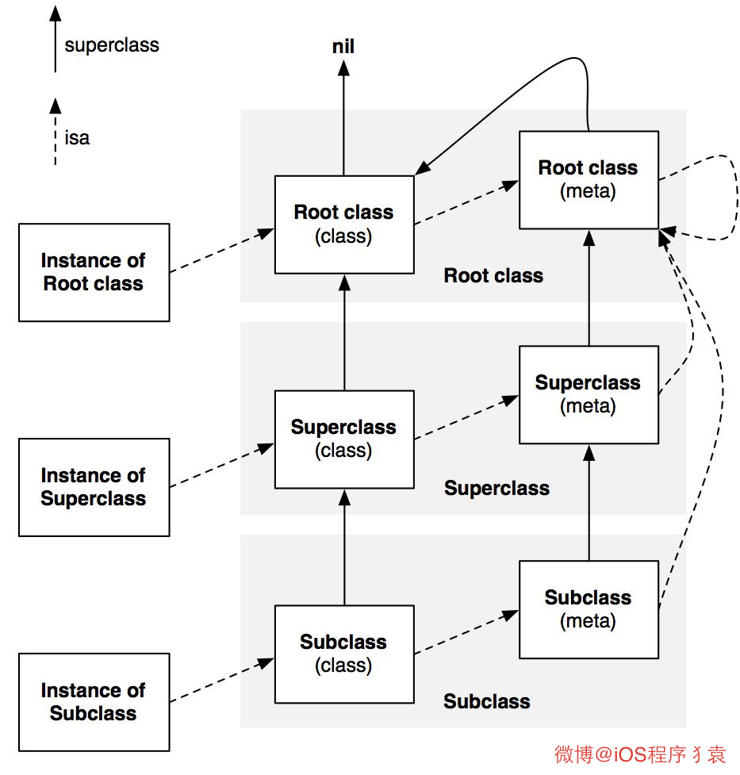

## Runtime 1 简介,对象、类的结构,消息传递

### 前言

对于 runtime，看了很多的文章， 开发过程中也零零碎碎的用到过，感觉都不甚全面。反反复复研究了几次，决定写下来。对于初学者，感觉 runtime 很高深，不敢涉足；对于经常使用 runtime 的人来说，觉得 runtime 就那么点东西，不足为奇。其实在我反复研究它的过程中，每次都有收获，因为它的原理不难，但是涉及很多，它贯穿这门语言，却刀锋尖利。

[Objective-C Runtime（一）](http://www.jianshu.com/p/c546d3e7858d)

- 简介
- 对象、类的结构
- - objc_object
- - objc_class
- 消息传递（Messaging）
- - objc_method
- - objc_msgSend

[Objective-C Runtime（二）](http://www.jianshu.com/p/fdf6d370c84c)

- 动态方法解析和转发
- - 动态方法解析
- - 快速消息转发
- - 标准消息转发
- - 消息转发与多继承
- - 消息转发与代理对象

[Objective-C Runtime（三）](https://www.jianshu.com/p/944c06b316aa)

- Method Swizzling
- - class_replaceMethod
- - method_setImplementation
- - method_exchangeImplementations
- - Method Swizzling 的应用
- - Method Swizzling 注意事项

[Objective-C Runtime（四）](https://www.jianshu.com/p/725ffc4cbc92)

- isa swizzling 
- - 介绍
- - 应用之KVO
- - 注意

**持续更新中...**


### 一. runtime 简介

Objective-C 扩展了 C 语言，并加入了面向对象特性和 Smalltalk 式的消息传递机制。而这个扩展的核心是一个用 C 和 编译语言 写的 Runtime 库。它是 Objective-C 面向对象和动态机制的基石。

Objective-C 是一个动态语言，这意味着它不仅需要一个编译器，也需要一个运行时系统来动态得创建类和对象、进行消息传递和转发。

OC与C语言的区别：

- 对于C语言，函数的调用在编译的时候会决定调用哪个函数。
- 对于OC的函数，属于动态调用过程，在编译的时候并不能决定真正调用哪个函数，只有在真正运行的时候才会根据函数的名称找到对应的函数来调用。
- 在编译阶段，OC可以**调用任何函数**，即使这个函数并未实现，只要声明过就不会报错。
- 在编译阶段，C语言**调用未实现的函数**就会报错。

### 二：对象、类的结构

在了解OC的消息传递之前，我们先明确对象、类的结构。

在OC中，类、对象都是一个C的结构体，从`objc/objc.h`和`objc/runtime.h`头文件中，我们可以找到它们的定义：

```
typedef struct objc_class *Class;
typedef struct objc_object *id;

struct objc_object {
    Class _Nonnull isa  OBJC_ISA_AVAILABILITY; //指向它的类对象
};

struct objc_class {
    Class _Nonnull isa  OBJC_ISA_AVAILABILITY; //isa指针指向Meta Class，因为Objc的类的本身也是一个Object，为了处理这个关系，runtime就创造了Meta Class，当给类发送[NSObject alloc]这样消息时，实际上是把这个消息发给了Class Object

#if !__OBJC2__
    Class _Nullable super_class		OBJC2_UNAVAILABLE; //父类
    const char * _Nonnull name		OBJC2_UNAVAILABLE; //类名
    long version		OBJC2_UNAVAILABLE; //类的版本信息，默认为0
    long info			OBJC2_UNAVAILABLE; //类信息，供运行期使用的一些位标识
    long instance_size		OBJC2_UNAVAILABLE; //该类的实例变量大小
    struct objc_ivar_list * _Nullable ivars		OBJC2_UNAVAILABLE; //该类的成员变量链表
    struct objc_method_list * _Nullable * _Nullable methodLists		OBJC2_UNAVAILABLE; //方法定义的链表
    struct objc_cache * _Nonnull cache		OBJC2_UNAVAILABLE; //方法缓存，对象接到一个消息会根据isa指针查找消息对象，这时会在method Lists中遍历，如果cache了，常用的方法调用时就能够提高调用的效率。
    struct objc_protocol_list * _Nullable protocols		OBJC2_UNAVAILABLE; //协议链表
#endif

} OBJC2_UNAVAILABLE;
```
可以看到有`__OBJC2__ `和`OBJC2_UNAVAILABLE `标识，在objc2中已经不可用了，但在runtime的[源码](https://github.com/opensource-apple/objc4)中，包含的内容大致是一样的，只是结构略有不同。为了简单，我们就以这个定义来理解类和对象的结构是没问题的。

**对象（objc_object）**由isa指针和成员变量组成，其中isa指针指向它的类，其中成员变量包括所有父类和自己的成员变量：

Objective-C 对象的结构图|
-----|
isa指针|
根类的实例变量|
倒数第二层父类的实例变量|
...|
父类的实例变量|
类的实例变量|

例如：

```
@interface Father: NSObject{
    int _father;
}
@end
@implementation Father
@end

@interface Child: Father {
    int _child;
}
@end
@implementation Child
@end

int main(int argc, char * argv[]) {
	 Child *child = [[Child alloc] init];
    return 0;
}
```

然后在`return 0`的一行打断点，运行程序在断点停止时，在控制台输入`p *child`，可以看到如下输出：

```
(lldb) p *child
(Child) $0 = {
  Father = (_father = 0)
  _child = 0
}
```

这就是child对象的结构，从下到上分别是自己到根类的实例变量。

**类（objc_class）**主要组成：isa指向元类（Meta Class），`super_class `指向父类、`objc_method_list `存储实例方法。类里面和对象一样也有isa指针，说明类也是个对象，类是元类的实例。

**元类（objc_class）**，在类对象里的isa指针也指向一个`objc_class `类型的结构体，就是元类对象，结构和类对象一样，但是`objc_method_list `存储的是类方法。



### 三、消息传递（Messaging）

>I’m sorry that I long ago coined the term “objects” for this topic because it gets many people to focus on the lesser idea. The big idea is “messaging” – that is what the kernal[sic] of Smalltalk is all about... The key in making great and growable systems is much more to design how its modules communicate rather than what their internal properties and behaviors should be.

Alan Kay 曾多次强调 Smalltalk 的核心不是面向对象，面向对象只是 the lesser ideas，消息传递才是 the big idea。

在很多语言，比如 C ，调用一个方法其实就是跳到内存中的某一点并开始执行一段代码。没有任何动态的特性，因为这在编译时就决定好了。而在 Objective-C 中，[object foo] 语法并不会立即执行 foo 这个方法的代码。它是在运行时给 object 发送一条叫 foo 的消息。这个消息，也许会由 object 来处理，也许会被转发给另一个对象，或者不予理睬假装没收到这个消息。多条不同的消息也可以对应同一个方法实现。这些都是在程序运行的时候决定的。

事实上，在编译时你写的 Objective-C 函数调用的语法都会被翻译成一个 C 的函数调用`-objc_msgSend`。比如，下面两行代码就是等价的：

```
[array insertObject:foo atIndex:5];
objc_msgSend(array, @selector(insertObject:atIndex:), foo, 5);
```

#### 方法的结构（objc_method）

objc_class`里的`objc_method_list`本质是一个有 `objc_method` 元素的可变长度的数组。`objc_method`的定义如下：

```
struct objc_method {
    SEL _Nonnull method_name			OBJC2_UNAVAILABLE;
    char * _Nullable method_types		OBJC2_UNAVAILABLE;
    IMP _Nonnull method_imp				OBJC2_UNAVAILABLE;                            
}                                		OBJC2_UNAVAILABLE;
```

- SEL： 又叫选择器，表示一个方法的名字。Objective-C在编译时，会依据每一个方法的名字、参数序列，生成一个唯一的整型标识(Int类型的地址)，这个标识就是SEL。
- IMP： 实际上是一个函数指针，指向方法实现的首地址。定义：`id (*IMP)(id, SEL, ...)
`
- method_types：表示函数参数及返回值类型的字符串 (见[Type Encoding](https://developer.apple.com/library/content/documentation/Cocoa/Conceptual/ObjCRuntimeGuide/Articles/ocrtTypeEncodings.html)) 

#### objc_msgSend

**消息传递的关键**在于 `objc_object` 中的 isa 指针和 `objc_class` 中的 class dispatch table。举`objc_msgSend(obj, foo)`这个例子来说：

- 首先，通过 obj 的 isa 指针找到它的 class ;
- 在 class 的 method list 找 foo ;
- 如果 class 中没到 foo，继续往它的 superclass 中找 ;
- 旦找到 foo 这个函数，就去执行它的实现IMP .


但这种实现有个问题，效率低。但一个 class 往往只有 20% 的函数会被经常调用，可能占总调用次数的 80% 。每个消息都需要遍历一次`objc_method_list`并不合理。如果把经常被调用的函数缓存下来，那可以大大提高函数查询的效率。这也就是`objc_class`中另一个重要成员`objc_cache`做的事情 —— 再找到 foo 之后，把 foo 的`method_name`作为 key ，`method_imp`作为 value 给存起来。当再次收到 foo 消息的时候，可以直接在 cache 里找到，避免去遍历`objc_method_list`.

#### 隐藏参数

当`objc_msgSend`找到函数的实现，就会调用函数，并传递消息中所有的参数。也传递两个隐藏参数到函数中：

- 接收对象
- 方法选择器

这两个参数为方法的实现提供了调用者的信息。之所以说是隐藏的，是因为它们在定义方法的源代码中没有声明。它们是在编译期被插入实现代码的。

虽然这些参数没有显示声明，但在代码中仍然可以引用它们。我们可以使用self来引用接收者对象，使用_cmd来引用选择器。

#### 避免动态绑定

runtime的动态绑定让我们写代码时更具有灵活性，可以在消息的传递过程中做一些处理，比如转发或者交换方法的实现。不过灵活性也带来了性能上的损耗，毕竟我们需要去查找方法的实现，而不像函数调用来得那么直接。当然，方法的缓存一定程度上解决了这一问题。

如果想要避开这种动态绑定方式，我们可以获取方法实现的地址，然后像调用函数一样来直接调用它。特别是当我们需要在一个循环内频繁地调用一个特定的方法时，通过这种方式可以提高程序的性能。

NSObject类提供了methodForSelector:方法，让我们可以获取到方法的指针，然后通过这个指针来调用实现代码：

```
void (*setter)(id, SEL, BOOL);
int i;
setter = (void (*)(id, SEL, BOOL))[target methodForSelector:@selector(setFilled:)];
for (i = 0 ; i < 1000 ; i++)
    setter(targetList[i], @selector(setFilled:), YES);
```
前两个参数传递给接收对象（self）的程序和方法选择器（_cmd）。这些参数在方法语法中是隐藏的，但当该方法当成函数调用时，必须是显式的。   

### 参考

- [Objective-C Runtime Programming Guide 译](http://blog.csdn.net/iosswift/article/details/42245647)
- [Objective-C 的“多继承”](http://blog.csdn.net/yiyaaixuexi/article/details/8970734)
- [Objective-C的hook方案（一）: Method Swizzling](http://blog.csdn.net/yiyaaixuexi/article/details/9374411)
- [Objective-C Runtime](http://tech.glowing.com/cn/objective-c-runtime/)
- [Method Swizzling 和 AOP 实践](http://tech.glowing.com/cn/method-swizzling-aop/)
- [Associated Objects](http://nshipster.cn/associated-objects/)
- [Method Swizzling](http://nshipster.cn/method-swizzling/)
- [Runtime 六部文章](http://southpeak.github.io/categories/objectivec/)
- [为所欲为之API兼容-Runtime消息转发](http://www.jianshu.com/p/215eccc37f5e?utm_source=desktop&utm_medium=timeline)